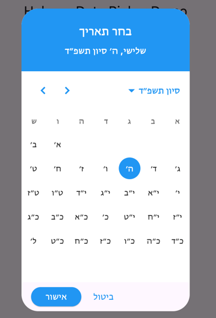

[](https://pub.dev/packages/material_hebrew_date_picker)
[](https://opensource.org/licenses/MIT)

# Material Hebrew Date Picker

A customizable Material Design Hebrew date picker for Flutter applications, supporting both single date and date range selection. This package provides a culturally appropriate date selection experience for apps.

<br/>

<!-- Insert a GIF of the date picker in action here -->
<p align="center">
  
</p>

## Features

- **Hebrew & Gregorian Calendars:** Seamlessly switch between Hebrew and Gregorian date displays.
- **Single & Range Selection:** Supports both single date and date range picking modes.
- **Enhanced Navigation:**
    - Quickly jump to any month or year by tapping the header.
    - Instantly navigate to the current date with the "Today" button.
    - Open the picker directly in the year or month view.
- **Layout Control:** Force a right-to-left or left-to-right layout for the calendar grid.
- **Customizable:**
    - Disable specific days of the week or individual dates.
    - Fully themeable to match your app's design.
- **Production Ready:** Null-safe, well-documented, and actively maintained.

## Installation

Add this to your package's `pubspec.yaml` file:

```yaml
dependencies:
  material_hebrew_date_picker: ^1.2.1
```

Then run `flutter pub get`.

## Usage

Import the package in your Dart code:

```dart
import 'package:material_hebrew_date_picker/material_hebrew_date_picker.dart';
```

### Showing a Dialog

To show the picker in a dialog, use one of the helper functions:

```dart
// For a single date
final DateTime? picked = await showMaterialHebrewDatePicker(
  context: context,
  ...
);

// For a date range
final DateTimeRange? range = await showMaterialHebrewDateRangePicker(
  context: context,
  ...
);
```

### Embedding the Picker

You can also embed the picker directly in your widget tree:

```dart
SizedBox(
  height: 400,
  width: 320,
  child: MaterialHebrewDatePicker(
    initialDate: DateTime.now(),
    firstDate: DateTime(2000),
    lastDate: DateTime(2100),
    onDateChange: (date) {
      print('New date selected: $date');
    },
  ),
)
```

### Advanced Usage with `kosher_dart`

For more advanced scenarios, such as setting date ranges based on the Hebrew calendar, you can use the [`kosher_dart`](https://pub.dev/packages/kosher_dart) package.

```dart
import 'package:kosher_dart/kosher_dart.dart';

void _showHebrewDateRange() async {
  final DateTime? picked = await showMaterialHebrewDatePicker(
    context: context,
    initialDate: DateTime.now(),
    // Use kosher_dart to set a specific Hebrew date range
    firstDate: (JewishDate()..setJewishDate(5784, JewishDate.TISHREI, 1))
        .getGregorianCalendar(), // Rosh Hashana 5784
    lastDate: (JewishDate()..setJewishDate(5784, JewishDate.NISAN, 22))
        .getGregorianCalendar(), // Last day of Pesach 5784
  );
  // ...
}
```

To use it, add `kosher_dart` to your `pubspec.yaml`:

```yaml
dependencies:
  kosher_dart: ^2.0.16 # Use the latest version
```

## API Reference

### `showMaterialHebrewDatePicker` & `showMaterialHebrewDateRangePicker`

| Parameter                | Description                                                                                             |
| ------------------------ | ------------------------------------------------------------------------------------------------------- |
| `context`                | The `BuildContext` for showing the dialog.                                                              |
| `initialDate`            | The initially selected date.                                                                            |
| `firstDate`              | The earliest selectable date.                                                                           |
| `lastDate`               | The latest selectable date.                                                                             |
| `hebrewFormat`           | If `true`, displays the calendar in Hebrew. Defaults to `true`.                                         |
| `selectableDayPredicate` | A function to disable specific days. Return `false` to disable a date.                                  |
| `initialPickerMode`      | The view to open the picker in (`day`, `month`, or `year`).                                             |
| `calendarDirection`      | The layout direction of the calendar grid (`ltr` or `rtl`). Defaults to `hebrewFormat`.                 |
| `theme`                  | A `HebrewDatePickerTheme` to customize the picker's appearance.                                         |

### `MaterialHebrewDatePicker` & `HebrewDateRangePicker`

These widgets share most of the parameters from the dialog functions above, with one key difference:

| Parameter      | Description                                                    |
| -------------- | -------------------------------------------------------------- |
| `onDateChange` | A callback that fires whenever the selected date changes.      |


## Customization

You can customize the appearance of the date picker using the `HebrewDatePickerTheme` class:

```dart
HebrewDatePickerTheme customTheme = HebrewDatePickerTheme(
  primaryColor: Colors.blue,
  onPrimaryColor: Colors.white,
  surfaceColor: Colors.white,
  onSurfaceColor: Colors.black87,
  disabledColor: Colors.grey,
  selectedColor: Colors.blue,
  todayColor: Colors.orange,
  headerTextStyle: const TextStyle(fontSize: 18, fontWeight: FontWeight.bold),
  bodyTextStyle: const TextStyle(fontSize: 14),
  weekdayTextStyle: const TextStyle(fontSize: 12, fontWeight: FontWeight.bold),
);

showMaterialHebrewDatePicker(
  // ... other parameters
  theme: customTheme,
);
```

## Contributing

Contributions are welcome! If you find a bug or have a feature request, please open an issue. If you want to contribute code, please follow these steps:

1.  Fork the repository.
2.  Create a new branch for your feature or bug fix.
3.  Make your changes and commit them with a clear message.
4.  Push your changes to your fork.
5.  Submit a pull request.

## License

This project is licensed under the MIT License - see the [LICENSE](LICENSE) file for details.
